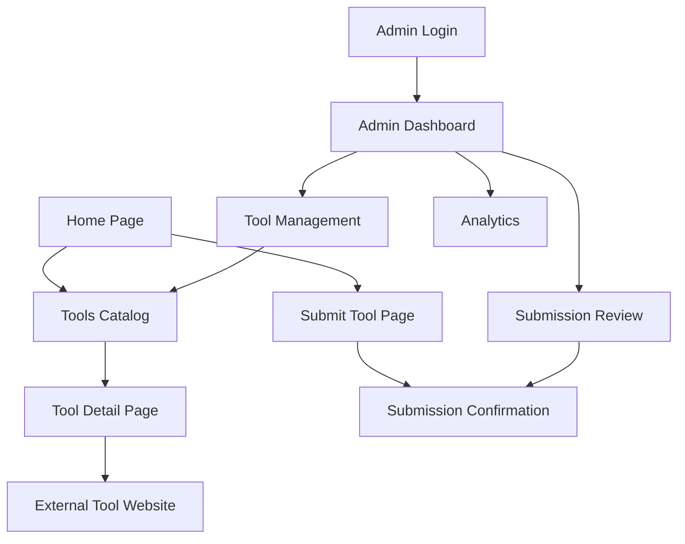

# AI Tools Directory - Product Requirements Document

## 1. Product Overview

The AI Tools Directory is a comprehensive web platform that curates and showcases the best AI tools available, helping users discover, compare, and access AI solutions for various use cases. The platform provides intelligent filtering, search capabilities, and detailed tool information to streamline the AI tool discovery process.

The platform addresses the growing need for a centralized, well-organized directory of AI tools as the AI ecosystem rapidly expands. It serves developers, content creators, businesses, and AI enthusiasts who need to find the right AI tools for their specific requirements.

Target market value: Capture the $50B+ AI tools market by becoming the go-to discovery platform for AI solutions.

## 2. Core Features

### 2.1 User Roles

| Role | Registration Method | Core Permissions |
|------|---------------------|------------------|
| Visitor | No registration required | Browse tools, search, filter, view tool details |
| Contributor | Email registration | Submit new tools for review, rate tools |
| Admin | Invitation-based access | Manage tool database, approve submissions, moderate content |

### 2.2 Feature Module

Our AI Tools Directory consists of the following main pages:

1. **Home Page**: Hero section with value proposition, featured trending tools showcase, category overview navigation
2. **Tools Catalog**: Advanced filtering system, search functionality, sorting options, grid/list view modes
3. **Tool Detail Page**: Comprehensive tool information, pricing details, user reviews, external links
4. **Submit Tool Page**: Tool submission form, contact information, review process explanation
5. **Admin Dashboard**: Tool management interface, submission review system, analytics overview

### 2.3 Page Details

| Page Name | Module Name | Feature description |
|-----------|-------------|---------------------|
| Home Page | Hero Section | Display compelling value proposition with search bar and call-to-action buttons |
| Home Page | Featured Tools | Showcase top 3 trending tools with popularity metrics and quick access |
| Home Page | Category Navigation | Provide quick access to major tool categories with visual icons |
| Tools Catalog | Filter Bar | Enable filtering by category, pricing model, popularity metrics with clear/reset options |
| Tools Catalog | Search System | Implement real-time search across tool names, descriptions, and keywords |
| Tools Catalog | Tool Grid | Display tools in responsive grid/list layout with hover effects and quick actions |
| Tools Catalog | Sorting Options | Sort by daily/weekly/monthly popularity, pricing, alphabetical order |
| Tools Catalog | View Modes | Toggle between grid-hover, grid-visible, and list view modes |
| Tool Detail Page | Tool Information | Show comprehensive details including description, pricing, features, screenshots |
| Tool Detail Page | External Links | Provide direct access to tool website with proper tracking and security |
| Tool Detail Page | Popularity Metrics | Display usage statistics, trending indicators, and user engagement data |
| Submit Tool Page | Submission Form | Collect tool URL, contact information, and basic tool details for review |
| Submit Tool Page | Review Process | Explain submission guidelines, review timeline, and approval criteria |
| Admin Dashboard | Tool Management | Add, edit, delete tools with rich form interface and validation |
| Admin Dashboard | Submission Review | Review pending submissions with approve/reject workflow |
| Admin Dashboard | Analytics Overview | Display platform metrics, popular tools, and user engagement statistics |

## 3. Core Process

**Visitor Flow:**
Users land on the homepage, explore featured tools, use search/filter to find specific tools, view detailed tool information, and access external tool websites.

**Contributor Flow:**
Users submit new tools via the submission form, provide contact details, wait for admin review, and receive notification of approval status.

**Admin Flow:**
Admins access the dashboard, review tool submissions, manage existing tool database, monitor platform analytics, and moderate user-generated content.

## 4. User Interface Design

### 4.1 Design Style

- **Primary Colors**: Slate-800 (#1e293b) for dark elements, Slate-200 (#e2e8f0) for light backgrounds
- **Secondary Colors**: Neutral-500 (#6b7280) for text, White/Black for theme contrast
- **Button Style**: Rounded corners (rounded-lg), subtle shadows, smooth hover transitions
- **Font**: System font stack with sans-serif fallback, 14px-16px base size
- **Layout Style**: Clean card-based design with consistent spacing, top navigation with search
- **Icons**: Minimalist line icons with consistent stroke width, trending and utility icons

### 4.2 Page Design Overview

| Page Name | Module Name | UI Elements |
|-----------|-------------|-------------|
| Home Page | Hero Section | Large typography (text-4xl to text-6xl), gradient backgrounds, centered layout with CTA buttons |
| Home Page | Featured Tools | Card-based layout with hover effects, popularity badges, clean typography with tool thumbnails |
| Tools Catalog | Filter Bar | Horizontal pill-style category buttons, dropdown sorting, search input with icon |
| Tools Catalog | Tool Grid | Responsive grid (1-4 columns), card hover animations, consistent aspect ratios, loading states |
| Tool Detail Page | Tool Information | Two-column layout, large tool screenshot, pricing badges, feature lists with icons |
| Submit Tool Page | Form Interface | Clean form design with validation states, progress indicators, helpful placeholder text |
| Admin Dashboard | Management Interface | Table-based layout with action buttons, modal dialogs, status indicators, bulk operations |

### 4.3 Responsiveness

The platform is mobile-first responsive with breakpoints at sm (640px), md (768px), lg (1024px), and xl (1280px). Touch interactions are optimized for mobile devices with appropriate touch targets (minimum 44px). The design adapts from single-column mobile layout to multi-column desktop layout with consistent spacing and typography scaling.