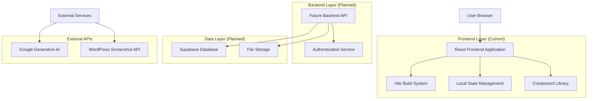
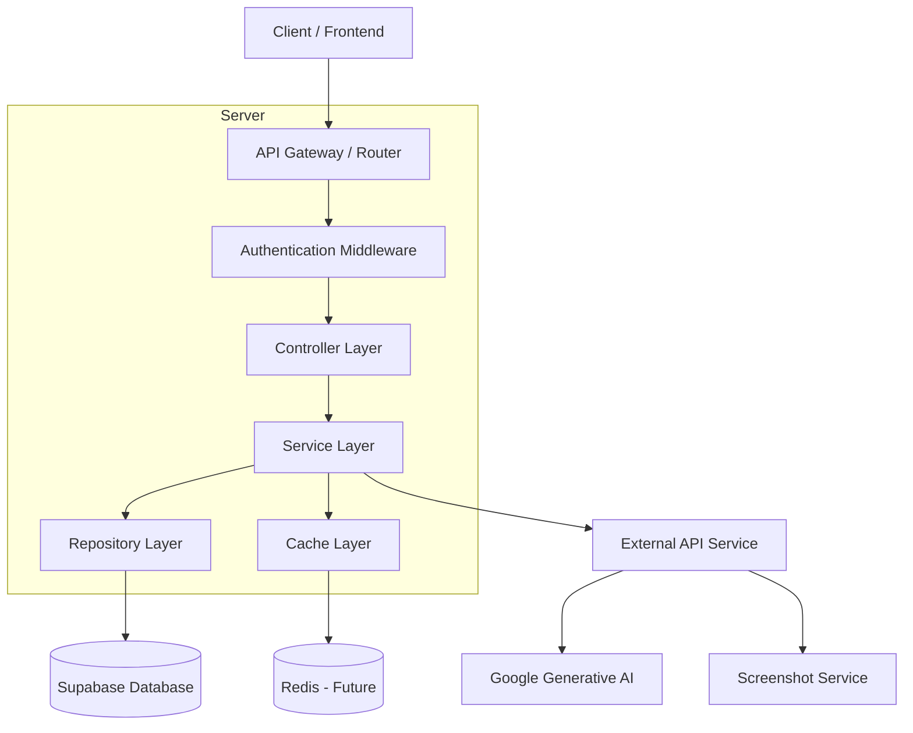
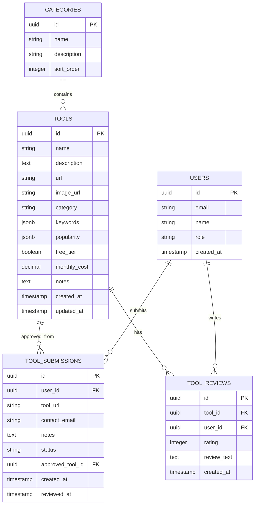

# AI Tools Directory - Technical Architecture Document

## 1. Architecture Design



## 2. Technology Description

**Current Stack:**

* Frontend: React\@19.2.0 + TypeScript\@5.8.2 + Vite\@6.2.0

* Styling: Tailwind CSS (via CDN)

* State Management: React useState/useEffect hooks

* External APIs: Google Generative AI\@0.21.0, WordPress mshots API

**Recommended Future Stack:**

* Frontend: React\@19.2.0 + TypeScript\@5.8.2 + Vite\@6.2.0 + Tailwind CSS\@3

* Backend: Supabase (PostgreSQL + Auth + Storage)

* Testing: Vitest + React Testing Library + Playwright

* CI/CD: GitHub Actions + Vercel/Netlify

* Monitoring: Sentry + Vercel Analytics

## 3. Route Definitions

| Route              | Purpose                                        |
| ------------------ | ---------------------------------------------- |
| /                  | Home page with hero section and featured tools |
| /tools             | Main tools catalog with filtering and search   |
| /tools/:id         | Individual tool detail page (future)           |
| /submit            | Tool submission form for contributors          |
| /admin             | Admin dashboard for tool management            |
| /admin/submissions | Review pending tool submissions                |
| /admin/analytics   | Platform usage analytics and metrics           |

## 4. API Definitions

### 4.1 Core API (Future Implementation)

**Tool Management**

```
GET /api/tools
```

Request:

| Param Name | Param Type | isRequired | Description               |
| ---------- | ---------- | ---------- | ------------------------- |
| category   | string     | false      | Filter by tool category   |
| search     | string     | false      | Search query for tools    |
| sort       | string     | false      | Sort by popularity metric |
| limit      | number     | false      | Number of tools to return |
| offset     | number     | false      | Pagination offset         |

Response:

| Param Name | Param Type | Description                      |
| ---------- | ---------- | -------------------------------- |
| tools      | Tool\[]    | Array of tool objects            |
| total      | number     | Total number of tools            |
| hasMore    | boolean    | Whether more tools are available |

Example Response:

```json
{
  "tools": [
    {
      "id": 1,
      "name": "ChatGPT",
      "description": "AI conversational model",
      "category": "Productivity",
      "url": "https://chat.openai.com",
      "imageUrl": "https://example.com/image.jpg",
      "popularity": {
        "daily": 200,
        "weekly": 1400,
        "monthly": 5600
      },
      "freeTier": true,
      "monthlyCost": 20,
      "keywords": ["chatbot", "assistant"]
    }
  ],
  "total": 100,
  "hasMore": true
}
```

**Tool Submission**

```
POST /api/tools/submit
```

Request:

| Param Name | Param Type | isRequired | Description                 |
| ---------- | ---------- | ---------- | --------------------------- |
| url        | string     | true       | Tool website URL            |
| contact    | string     | true       | Submitter contact email     |
| notes      | string     | false      | Additional submission notes |

Response:

| Param Name   | Param Type | Description                  |
| ------------ | ---------- | ---------------------------- |
| success      | boolean    | Submission status            |
| submissionId | string     | Unique submission identifier |
| message      | string     | Status message               |

## 5. Server Architecture Diagram (Future Implementation)



## 6. Data Model

### 6.1 Data Model Definition



### 6.2 Data Definition Language

**Tools Table**

```sql
-- Create tools table
CREATE TABLE tools (
    id UUID PRIMARY KEY DEFAULT gen_random_uuid(),
    name VARCHAR(255) NOT NULL,
    description TEXT NOT NULL,
    url VARCHAR(500) NOT NULL,
    image_url VARCHAR(500),
    category VARCHAR(100) NOT NULL,
    keywords JSONB DEFAULT '[]',
    popularity JSONB DEFAULT '{"daily": 0, "weekly": 0, "monthly": 0}',
    free_tier BOOLEAN DEFAULT true,
    monthly_cost DECIMAL(10,2),
    notes TEXT,
    created_at TIMESTAMP WITH TIME ZONE DEFAULT NOW(),
    updated_at TIMESTAMP WITH TIME ZONE DEFAULT NOW()
);

-- Create indexes
CREATE INDEX idx_tools_category ON tools(category);
CREATE INDEX idx_tools_popularity ON tools USING GIN (popularity);
CREATE INDEX idx_tools_keywords ON tools USING GIN (keywords);
CREATE INDEX idx_tools_created_at ON tools(created_at DESC);

-- Create tool submissions table
CREATE TABLE tool_submissions (
    id UUID PRIMARY KEY DEFAULT gen_random_uuid(),
    user_id UUID REFERENCES auth.users(id),
    tool_url VARCHAR(500) NOT NULL,
    contact_email VARCHAR(255) NOT NULL,
    notes TEXT,
    status VARCHAR(20) DEFAULT 'pending' CHECK (status IN ('pending', 'approved', 'rejected')),
    approved_tool_id UUID REFERENCES tools(id),
    created_at TIMESTAMP WITH TIME ZONE DEFAULT NOW(),
    reviewed_at TIMESTAMP WITH TIME ZONE
);

-- Create users table (extends Supabase auth.users)
CREATE TABLE user_profiles (
    id UUID PRIMARY KEY REFERENCES auth.users(id),
    email VARCHAR(255) NOT NULL,
    name VARCHAR(100),
    role VARCHAR(20) DEFAULT 'user' CHECK (role IN ('user', 'admin')),
    created_at TIMESTAMP WITH TIME ZONE DEFAULT NOW()
);

-- Row Level Security policies
ALTER TABLE tools ENABLE ROW LEVEL SECURITY;
ALTER TABLE tool_submissions ENABLE ROW LEVEL SECURITY;
ALTER TABLE user_profiles ENABLE ROW LEVEL SECURITY;

-- Grant permissions
GRANT SELECT ON tools TO anon;
GRANT ALL PRIVILEGES ON tools TO authenticated;
GRANT SELECT, INSERT ON tool_submissions TO authenticated;
GRANT ALL PRIVILEGES ON tool_submissions TO authenticated;

-- Initial data
INSERT INTO tools (name, description, url, category, keywords, popularity, free_tier, monthly_cost, notes) VALUES
('ChatGPT', 'A conversational AI model by OpenAI that can generate human-like text.', 'https://chat.openai.com/', 'Productivity', '["chatbot", "assistant", "writing"]', '{"daily": 200, "weekly": 1400, "monthly": 5600}', true, 20, 'Free basic, paid unlocks priority, images, more quotas'),
('Midjourney', 'An independent research lab exploring new mediums of thought.', 'https://www.midjourney.com/', 'Creative', '["image generation", "art", "design"]', '{"daily": 150, "weekly": 1050, "monthly": 4200}', false, 10, 'Paid only, no trial');
```

